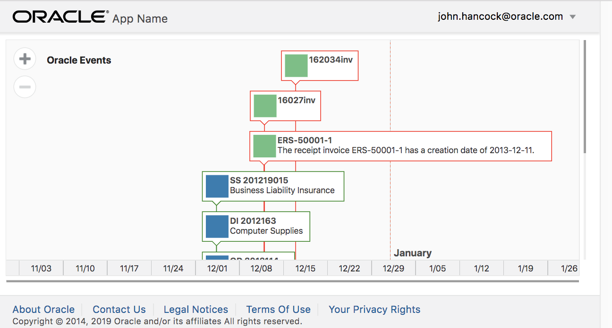
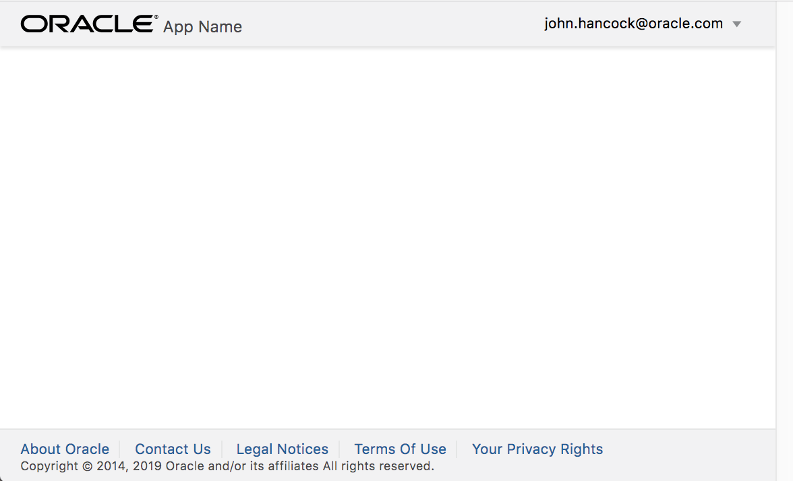
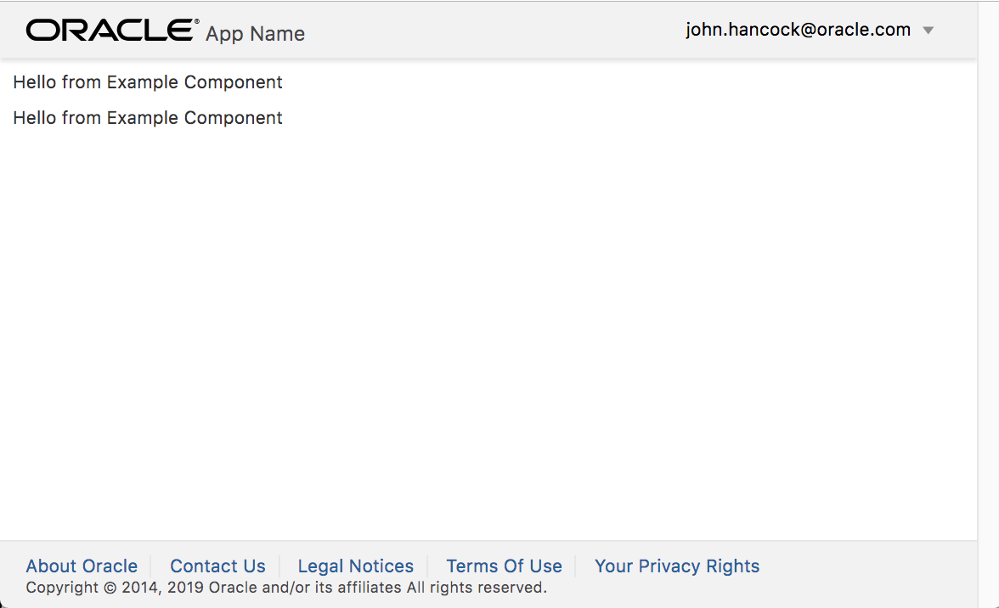
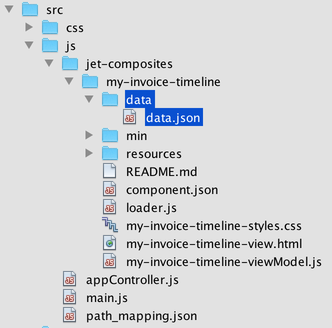
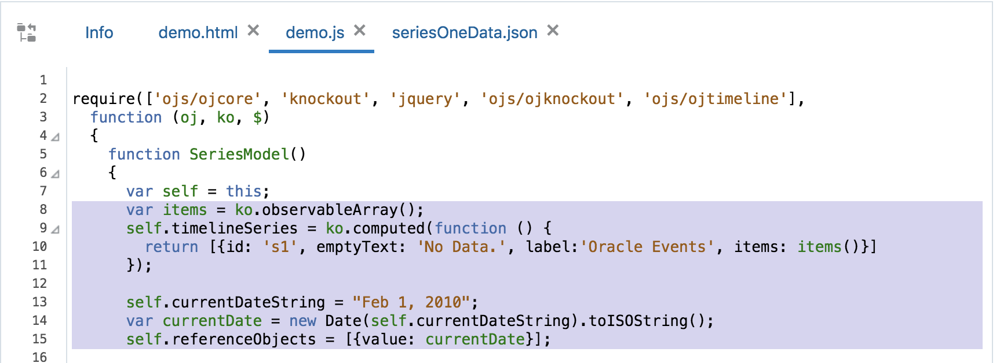
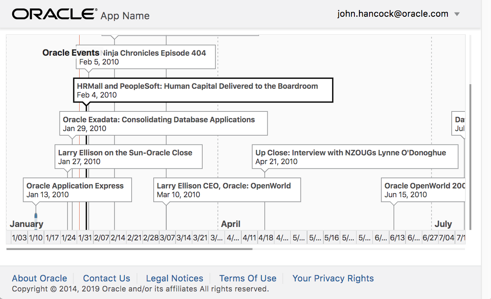
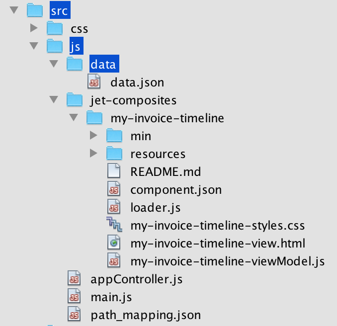
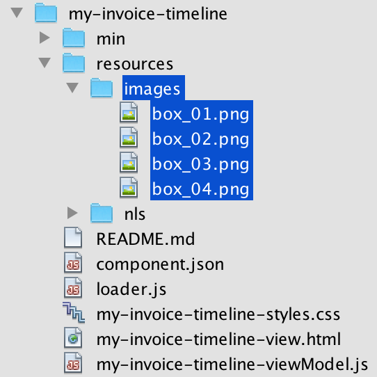
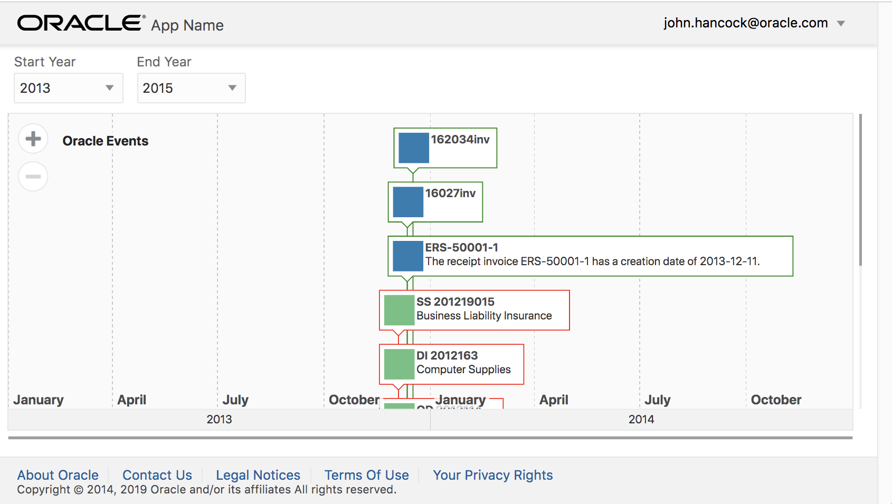

# Workshop: Develop a Web Component for Visual Builder Interaction with Oracle ERP
This workshop shows how to create a Web Component for 
use within an Oracle JET Core application or within Visual Builder, containing a JET Timeline component 
that will read data from an Oracle ERP Service, showing invoice information. 

Specifically, within an Oracle JET Core application, the Web Component you will create will look as follows, [using this Oracle ERP data](https://gist.githubusercontent.com/peppertech/8a9691dc68b0a1466b0b7012b86e2578/raw/6281de2f93103bbe531a6bbb7e629c964865e896/erpData.json), retrieved from a live demo Oracle ERP service:

<table><tr><td>   

</td></tr></table>

## 1: Get Started

All the activities in this section should be done on the command line in a Terminal window.

### (a) Getting the Node Package Manager

Node.js is a JavaScript runtime, which provides 'npm', that is, the Node Package Manager, that you will use in the sections that follow to set up the environment that you need.

To verify the Node Package Manager is installed, run the following, which should show you the version of the Node Package Manager:
```js #button { border: none; }   
npm -v
```

If version 5.6.0 or higher is not shown, you need to install the latest LTS version of Node.

Download and install the latest LTS version of Node from http://nodejs.org.

### (b) Getting Oracle JET

In this part, you install the Oracle JET command-line interface.

1. Install the Oracle JET command-line interface:

```js #button { border: none; }
npm install -g @oracle/ojet-cli
```

2. Run the following to check installation succeeded and to see the available commands:

```js #button { border: none; }
ojet help
```

You should see information about Oracle JET command line arguments.

3. Run the following to check that you have the correct version of Oracle JET:

```js #button { border: none; }
ojet --version
```

You should see this:

```html #button { border: none; }
Oracle JET Command Line Interface, version: 6.2.0
```

**Tip:** If the above shows that you have an **earlier** version of the Oracle JET command-line interface, i.e., below 6.2.0, please reinstall Oracle JET, using the command in step 1 above to do so.

You are now ready to get started with Oracle JET!

### (c) Creating an Oracle JET Application

**We will use the Oracle JET 'basic' template so that we have the simplest possible Oracle JET application, enabling us to focus on component creation in the next section, and not on routing. The 'basic' template will give us an 'index.html' file, where we will design the component, with the data initially hardcoded and coming from the 'src/js/appControler.js' file.**

1. Run the following in the terminal:

```js #button { border: none; }
ojet create BasicApp --template=basic
```
**Note:** This process may take some time.

2. CD into 'BasicApp' and run the following in the terminal and look in the browser:

```js #button { border: none; }
ojet serve
```

After a few moments, you should see an empty page in the browser:

<table><tr><td>   

</td></tr></table>

**Note:** Make sure you have a JavaScript editor, such as Visual Studio or Apache NetBeans, and open the sources created in step 1 above. Simply using Notepad will not provide the syntax coloring and other JavaScript editor features you need. 

## 2: Develop the Web Component

**Note:** **Before going further, in the Terminal window, first kill the 'ojet' process, using Ctrl-C. This is because you will be adding new files in this section. Whenever you add new files, first kill the 'ojet' process in the Terminal window, using Ctrl-C, and then, after creating new files as in step 2 below, restart the 'ojet' process via 'ojet serve'. The 'watch' process, provided by 'ojet', will only look for changes to existing files; it will not build and re-serve new files.**

### (a) Creating a Web Component

1. In the root of your project, run the following command line, **after** reading the note below:

**Note:** Instead of the 'my-' prefix in the command line below, **use your initials or use your company prefix**, to make your Web Component unique and not conflict with others. Remember to never use 'oj-' as prefix, which is reserved for the Oracle JET team.

```js #button { border: none; }
ojet create component my-invoice-timeline
```
2. Take a look at your source structure. Find the new 'my-invoice-timeline' Web Component, in the 'src/js/jet-composites' folder, and explore its structure, as shown below.

<table><tr><td>   

</td></tr></table>

3. Open the files in the 'my-invoice-timeline' Web Component. In particular, notice that the demo message 'Hello from Example Component' is defined in 'my-invoice-timeline-viewModel.js', while it is rendered in 'my-invoice-timeline-viewModel.html'.

4. Open the 'src/js/appControler.js' file. Load the loader, i.e., 'my-invoice-timeline/loader', at the end of the dependency list passed into the 'define' block of the 'src/js/appControler.js', as shown below:

```js #button { border: none; }
define(['ojs/ojcore', 'knockout', 'ojs/ojknockout', 'my-invoice-timeline/loader'],
```

5. Open the 'src/js/index.html' file. Use the 'my-invoice-timeline' custom element a few times in the 'index.html' file, as shown below, **and put them within the 'div' that has its role set to 'main'**.

```html #button { border: none; }
<my-invoice-timeline></my-invoice-timeline>
<my-invoice-timeline></my-invoice-timeline>
```

6. Run 'ojet serve' in the Terminal again, and notice that you now see two instances of the 'Hello from Example Component' message from the 'my-invoice-timeline' Web Component, as shown below:

<table><tr><td>   

</td></tr></table>

**Note:** As stated above, you needed to run 'ojet serve' to serve the application, since you killed the 'ojet' process in step 1 of this section.

**Tip:** We'll need to display only one Timeline component in our page, so to avoid confusion later when the above will cause the component to render more than once, make sure to have only one 'my-invoice-timeline' custom element in your 'index.html' before continuing.

### (b) Set Up a Timeline Component from the Cookbook

We are going to take the [Single Series Timeline from the Oracle JET Cookbook](https://www.oracle.com/webfolder/technetwork/jet/jetCookbook.html?component=timeline&demo=basicTimeline) as a starting point and then customize it to our requirements in subsequent sections.

1. Put [this static data](https://gist.githubusercontent.com/peppertech/52bee52327ae9a1c0958559da78508a8/raw/61e68f85f5e83fd4cf70361d11840f65d522e337/seriesOneData.json) into a file named 'data.json', in a new folder named 'data', in the 'src/js/jet-composites/my-invoice-timeline' folder, as shown below:

<table><tr><td>   

</td></tr></table>

2. Load the 'data.json' file into your Web Component by using the 'text!' protocol, as shown below, in the 'my-invoice-timeline-viewModel.js' file. **In addition**, make sure to reference the 'data.json' file in the callback function, as 'data', for example, shown below, in the same order as in the define statement:

```js #button { border: none; }
define(
    ['knockout', 
     'text!./data/data.json', 
     'jquery', 'ojL10n!./resources/nls/my-invoice-timeline-strings'], 
        function (ko, data, $, componentStrings) {
```

**Note:** In the above, note that we added 'text!./data/data.json' to the define block **and** we added 'data' to the callback function. Both are needed! And note that the reference to the data.json file is the second parameter in the define block **and** in the callback function.
        
3. In the 'my-invoice-timeline-viewModel.js' file, replace the example variable 'self.messageText' with the following content, copied and pasted directly from line 8 to 15 in 'demo.js' from the [Single Series Timeline from the Oracle JET Cookbook](https://www.oracle.com/webfolder/technetwork/jet/jetCookbook.html?component=timeline&demo=basicTimeline):

<table><tr><td>   

</td></tr></table>

After copying and pasting the above, change the variable 'items' so that the reference to the 'data' initializes it:

```js #button { border: none; }
var items = ko.observableArray(JSON.parse(data));
```

4. In the View, that is, the 'my-invoice-timeline-view.html' file, delete all the existing content, and drop in a Timeline component, here it is copied and pasted directly from the [Single Series Timeline from the Oracle JET Cookbook](https://www.oracle.com/webfolder/technetwork/jet/jetCookbook.html?component=timeline&demo=basicTimeline).

```html #button { border: none; }
<oj-timeline id='tline' 
             minor-axis='{
               "scale": "weeks",
               "zoomOrder": ["months", "weeks", "days"]
             }'
             major-axis.scale='quarters'
             start='[[new Date("Jan 1, 2010").toISOString()]]'
             end='[[new Date("Dec 31, 2010").toISOString()]]'
             selection-mode='single'
             reference-objects='[[referenceObjects]]'
             selection='["e4"]'
             series='[[timelineSeries]]'
             style='width:100%;height:350px'>
</oj-timeline>
```
5. For the above to work, in particular, for the Timeline component to be loaded, make sure to include a reference to 'ojs/ojtimeline' at the end of the 'define' block in the 'my-invoice-timeline-viewModel.js' file, as shown below:

```js #button { border: none; }
define(
    ['knockout', 
     'text!./data/data.json', 
     'jquery', 'ojL10n!./resources/nls/my-invoice-timeline-strings',
     'ojs/ojtimeline'], 
        function (ko, data, $, componentStrings) {
```

6. In the browser, check that you now see the Timeline scenario working and displaying data, exactly as shown in the [Single Series Timeline from the Oracle JET Cookbook](https://www.oracle.com/webfolder/technetwork/jet/jetCookbook.html?component=timeline&demo=basicTimeline), and as shown below:

<table><tr><td>   

</td></tr></table>

**Note:** As in the previous section, since you created a new file, i.e., 'data/data.json' in the Web Component above, you need to kill the 'ojet' process and run 'ojet serve' again to serve the application.

### (c) Understand Best Practices for Web Component Development

Now that we have the basic Web Component working, let's talk about best practices in Web Components.

1. Read [Best Practices for Web Component Creation](http://www.oracle.com/pls/topic/lookup?ctx=jetlatest&id=GUID-1A0A3469-AB57-4C0D-B1C7-FB49B5FBA0DF).

2. In particular, read 'Expensive Initialization', about Web Components ideally carrying out minimum work inside the constructor function. The constructor is just for setting up the variables, doing basic set up, no data manipulating, no heavy lifting.

3. Where we will do the more complex tasks and processing, will be done through a combination of lifecycle methods and custom Prototype methods, such as the following:

This is called one time and initializes data in your code:

```js #button { border: none; }
ExampleComponentModel.prototype.bindingsApplied = function(context){
  ...
};
```

Called whenever a component's property actually changes:

```js #button { border: none; }
ExampleComponentModel.prototype.propertyChanged = function(context){
  ...
};
```

### (d) Use External Data

Rather than providing a Web Component together with its own data, we want to be able to pass in data from outside the Web Component. In this section, as an intermediate step, we will move the 'data.json' file outside the Web Component, while in subsequent sections we will access the data via a REST endpoint.

1. Move the 'data.json' file into a folder outside the Web Component, that is, in the containing application in a new folder in 'src/js', named 'data', as shown below:

<table><tr><td>   

</td></tr></table>

2. In the containing application's 'appControler.js' file, i.e., 'src/js/appControler.js', pull in the data that you're going to pass into the component:

```js #button { border: none; }
self.dataArray = ko.observable();

var url = "/js/data/data.json";

$.getJSON(url).then(function (results) {
    // assign the DataProvider to the self.dataArray observable
    self.dataArray(new ArrayDataProvider(results, {keyAttributes: 'id'}));
})
```

3. For the above to work, in particular, the 'ArrayDataProvider' reference, make sure to include a reference to 'ojs/ojarraydataprovider' in the 'define' block in 'src/js/appControler.js', together with a reference in the same order to 'ArrayDataProvider' in the function callback, as shown below:

```js #button { border: none; }
define(['ojs/ojcore', 'knockout', 'ojs/ojarraydataprovider', 
    'ojs/ojknockout', 'my-invoice-timeline/loader'],
  function(oj, ko, ArrayDataProvider) {
```  

4. Since 'data.json' now comes from the containing application and we're using the code above to access it as described above, you'll now need to slightly refactor the Web Component's 'my-invoice-timeline-viewModel.js' file, because 'data.json' is now no longer loaded via the 'text!' protocol in the Web Component:

```js #button { border: none; }
define(
    ['knockout', 
//     'text!./data/data.json', 
     'jquery', 
     'ojL10n!./resources/nls/my-invoice-timeline-strings',
     'ojs/ojtimeline'], 
        function (ko, /**data,**/ $, componentStrings) {
```

Above, notice that the 'text!' protocol reference has been commented out, **as well as** its 'data' reference.

Similarly, in the Web Component's 'my-invoice-timeline-viewModel.js' file, rewrite this statement:

```js #button { border: none; }
var items = ko.observableArray(JSON.parse(data));
```

...to the following, that is, we are no longer receiving the data from the comnstructor:

```js #button { border: none; }
self.items = ko.observableArray();
```

Two lines below the above, make sure to change the reference to 'items()' to the following instead:

```js #button { border: none; }
self.items()
```

5. Read 'Access to External Data' in [Best Practices for Web Component Creation
](https://docs.oracle.com/en/middleware/jet/6.1/develop/best-practices-web-component-creation.html#GUID-1A0A3469-AB57-4C0D-B1C7-FB49B5FBA0DF) and let's look at our properties. Let's set up an attribute for passing our data in from. To get started, in the Web Component's 'component.json' file, add a property named 'items', as shown below. 

```js #button { border: none; }
"properties": {
    "items": {
      "type": "oj.DataProvider",
      "description": "data items for the timeline series"
    }
},
```
**Note:** We are going to pass in an array, but we're building these components in anticipation of wanting to use them in Visual Builder as well as in Oracle JET Core applications. We use '[oj.DataProvider](https://www.oracle.com/webfolder/technetwork/jet/jsdocs/oj.DataProvider.html)' here because Visual Builder passes all data declaratively via a service data provider or an array data provider, both of which can be mapped to 'oj.DataProvider'.

6. The Web Component will not pull in its own data, instead, it will handle the data that is passed into it. You will more than likely have multiple usages of your Web Component, so that the data needs to come from the outside, that is, from the containing application. Therefore, reference 'dataArray' as the value of the 'items' attribute in the 'index.html' file, as follows:

```html #button { border: none; }
<my-invoice-timeline id='myinvoicetimeline' items="[[dataArray]]"></my-invoice-timeline>
```

7. In the Web Component's 'my-invoice-timeline-viewModel.js' file, since we want to keep the constructor as clean as possible for initialization, as discussed in the previous section, we will now use a combination of our own Prototype methods and later get and shape data there, too, in 'my-invoice-timeline-viewModel.js', after the constructor: 

```js #button { border: none; }
// Used for initialization of the data.
ExampleComponentModel.prototype.bindingsApplied = function (context) {
    var self = this;
    self.items(self.properties.items);
};

// Used to handle the use case where the dataProvider passed into the component changes at runtime.
ExampleComponentModel.prototype.propertyChanged = function (context) {
    var self = this;
    if (context.property === 'items' && context.updatedFrom === 'external') {
        self.items(self.properties.items);
    }
};
```
8. If you run the application right now, you will see no data is displayed. If we debug, and look to see what the value of 'self.properties.items' is inside the 'propertyChanged' function above, we will find that 'items' is a 'DataProvider' object. Instead, the Timeline component expects an array, in a specific format. Let's therefore create a Prototype function that extracts the array data from the DataProvider, as below, in the Web Component's 'my-invoice-timeline-viewModel.js' file:

```js #button { border: none; }
ExampleComponentModel.prototype._extractArrayFromDataProvider =
  function (dataProvider, rowTransformer, rowLimit) {
    var self = this;
    return new Promise(function (resolve) {
      var limit = rowLimit ? rowLimit : 20;
      if (dataProvider) {
        var options = {
          size: limit
        };
        // If a transformation callback function was provided, return true.
        var doTransform = (typeof rowTransformer === 'function');
        // return the data from the DataProvider
        var dpIterator = dataProvider.fetchFirst(options)[Symbol.asyncIterator]();
        // iterate through the data and build the array of data for the timeline.
        dpIterator.next().then(function (result) {
          var extractedArray = [];
          if (result.value.data && result.value.data.length > 0) {
            result.value.data.forEach(function (row, index, allArray) {
              extractedArray.push(doTransform ? rowTransformer(row) : row);
            });
          }
          self.emptyTextMessage('No data available');
          resolve(extractedArray)
        });
      }
      else {
        resolve([]);
      }
    });
  };
```

**Note:** In the above, reference is made to 'self.emptyTextMessage'. Define it as follows, in the constructor:

```js #button { border: none; }
self.emptyTextMessage = ko.observable('Loading data...');
```

9. Incorporate calls to the above in the earlier Prototype code:

```js #button { border: none; }
// Used for initialization of the data.
ExampleComponentModel.prototype.bindingsApplied = function (context) {
    var self = this;
    self._extractArrayFromDataProvider(self.properties.items)
            .then(function (transformedArray) {
                self.items(transformedArray);
            });
};

// Used to handle the use case where the dataProvider passed into the component changes at runtime.
ExampleComponentModel.prototype.propertyChanged = function (context) {
    var self = this;
    if (context.property === 'items' && context.updatedFrom === 'external') {
        self._extractArrayFromDataProvider(context.value)
                .then(function (transformedArray) {
                    self.items(transformedArray);
                });
    }
};
```
10. In the browser, check that you now see the Timeline scenario working and displaying data, exactly as shown in the previous section, and as shown below:

<table><tr><td>   

</td></tr></table>

**Note:** As in the previous sections, since you created a new file, i.e., 'src/js/data/data.json' above, you need to kill the 'ojet' process and run 'ojet serve' again to serve the application.

### (e) Shaping External Data

The data that we're passing into the Web Component from the containing application is already formatted in the structure that the Timeline component expects. This is almost never going to happen in reality. We will need to **shape** the data coming in from the REST Service to conform to the structure that the Timeline component expects. Below, you learn how to customize attributes of the Timeline component based on the data coming in, in particular, the thumbnail and styling of the Timeline component.

1. Put [this static data](https://gist.githubusercontent.com/peppertech/8a9691dc68b0a1466b0b7012b86e2578/raw/6281de2f93103bbe531a6bbb7e629c964865e896/erpData.json) into a file named 'erpData.json', in the folder where you already have 'data.json', as shown below:

<table><tr><td>   

</td></tr></table>

2. Create another Prototype function that extracts the array data from the DataProvider, as shown below, in the Web Component's 'my-invoice-timeline-viewModel.js' file:

```js #button { border: none; }
// mapping the data from the REST service into a format that the timeline expects.
// Also setting special styles and thumbnail images based on specific values in the data.
ExampleComponentModel.prototype._shapeTimelineData = function (sourceRow) {
    // change the border style and thumbnail color based on type of status type
    var status = {
        Requested: {
            color: 'green',
            img: require.toUrl('my-timeline/resources/images/box_01.png')
        },
        Denied: {
            color: 'red',
            img: require.toUrl('my-timeline/resources/images/box_02.png')
        }
    };
    // Alternate option, changes the style and thumbnail based on transaction source.
    var transactionSourceDetails = {
        Manual: {
            color: 'green',
            img: require.toUrl('my-timeline/resources/images/box_01.png')
        },
        Electronic: {
            color: 'red',
            img: require.toUrl('my-timeline/resources/images/box_02.png')
        }
    };
    return {
        id: sourceRow.id,
        title: sourceRow.BusinessUnit,
        start: sourceRow.TransactionDate,
        description: sourceRow.totalAmount,
        thumbnail: status[sourceRow.status].img,
        svgStyle: 'border-color:' + status[sourceRow.status].color + ';'
    };
};
```

3. We now need to connect calls to the code above to the 'bindingsApplied' and 'propertyChanged' Prototype methods we created earlier. In those two methods, find the two lines below:

```js #button { border: none; }
self._extractArrayFromDataProvider(context.value)
```

```js #button { border: none; }
self._extractArrayFromDataProvider(self.properties.items)
```

...and replace each of the above two lines with the following:

```js #button { border: none; }
self._extractArrayFromDataProvider(self.properties.items, self._shapeTimelineData, 10)
```

4. In the code in step 2 above, you're referring to images. These can be any 32x32 pixel images, or you can download those used in creating these instructions here, which should be available in the Web Component's 'resources/images' folder, as shown below:

<table><tr><td>   

</td></tr></table>

5. You need to make a few small tweaks to 'src/js/appControler.js', since you're working with different data now, i.e., 'erpData.json' has different kind of data than 'data.json' and therefore needs to be received slightly differently. Start by pointing to the 'erpData.json' where before you were referring to 'data.json':

```js #button { border: none; }
var url = "/js/data/erpData.json";
```

Next, notice in 'src/js/appControler.js', that you're referring to 'results' and 'id', as shown below:

```js #button { border: none; }
self.dataArray(new ArrayDataProvider(results, {keyAttributes: 'id'}));
```

Change that so that you're referring to 'results.items' and 'InvoiceId' instead, which are obtained from the 'erpData.json' file, as shown below:

```js #button { border: none; }
self.dataArray(new ArrayDataProvider(results.items, {keyAttributes: 'InvoiceId'}));
```

6. To be able to easily see the data in the Timeline, change the hardcoded start and end date in 'my-invoice-timeline-view.html' to the following. 

```html #button { border: none; }
start='[[new Date("November 1, 2013").toISOString()]]'
end='[[new Date("Jan 31, 2014").toISOString()]]'
```

In the next section, we will provide UI components for setting the start and end date dynamically.

7. In the browser, check that you now see the Timeline scenario working and displaying data, [this static data](https://gist.githubusercontent.com/peppertech/8a9691dc68b0a1466b0b7012b86e2578/raw/6281de2f93103bbe531a6bbb7e629c964865e896/erpData.json), and as shown below:

<table><tr><td>   

</td></tr></table>

**Note:** As in the previous sections, since you created a new file, i.e., 'src/js/data/erpData.json' above, and added new image files, you need to kill the 'ojet' process and run 'ojet serve' again to serve the application.

### (f) Add Advanced Features

In this section, you'll add some user interface components to your Web Component for letting the user set the range of years to be handled by the Timeline component. You will use Oracle JET's [FormLayout](https://www.oracle.com/webfolder/technetwork/jet/jetCookbook.html?component=ojFormLayout&demo=formverticalofl) with two select boxes, one for the start year and one for the end year. You'll also add a year generator, which will generate years to be displayed in the range pulldowns you'll be creating to set the start date and end date of your timeline.

**Note:** The idea here is that we're adding more value to the component itself: in the end, our Web Component won't simply be a Timeline, it will also have additional features. This illustrates that you can enhance existing Oracle JET components by combining them together into a Web Component.

1. Start by completely replacing everything in 'my-invoice-timeline-view.html' with the below:

```html #button { border: none; }
<div id="container" class="oj-flex oj-flex-items-padding">
    <oj-form-layout label-edge="top" max-columns="2" direction="row">
        <oj-label id="startYearLbl" for="startYear" value="Start Year">Start Year</oj-label>
        <oj-select-one id="startYear" options="[[yearList]]" value="{{startYearValue}}"></oj-select-one>
        <oj-label id="endYearLbl" for="endYear" value="End Year">End Year</oj-label>
        <oj-select-one id="endYear" options="[[yearList]]" value="{{endYearValue}}"></oj-select-one>
    </oj-form-layout>
</div>

<oj-timeline id="tline" 
             minor-axis='{
                "scale": "years",
                "zoomOrder": ["years", "months", "weeks", "days"]
             }' 
             major-axis.scale="quarters" 
             start="[[startDate]]" 
             viewport-start="[[startDate]]" 
             end="[[endDate]]" 
             viewport-end="[[endDate]]" 
             selection-mode="single"
             selection="[[itemSelection]]" 
             series="[[timelineSeries]]" 
             style="width:100%;min-height:350px">
</oj-timeline>
```

2. In 'my-invoice-timeline-view.js', load the components referenced above, that is, 'ojs/ojselectcombobox', 'ojs/ojlabel', and 'ojs/ojformlayout' by referencing them in the 'define' block, as shown below:

```js #button { border: none; }
define(
    ['knockout', 
     'jquery', 
     'ojL10n!./resources/nls/my-invoice-timeline-strings',
     'ojs/ojtimeline', 
     'ojs/ojselectcombobox',
     'ojs/ojlabel',
     'ojs/ojformlayout'], 
        function (ko, $, componentStrings) {
```        

3. In 'my-invoice-timeline-view.js', use a new Prototype function to create an array of years for use in the timeline range pulldowns, as shown below:

```js #button { border: none; }
// Creating an array of years for use in the timeline range pulldowns
ExampleComponentModel.prototype._generateYears = function (context) {
  var self = this;
  var tempArray = [];
  for (var year = 1950; year < 2050; year++) {
    tempArray.push({
      value: year,
      label: year
    });
  }
  self.yearList(tempArray);
};
```

4. In 'my-invoice-timeline-view.js', add the code below to the constructor to enable the start and end dates to be changed as needed:

```js #button { border: none; }
self.itemSelection = ko.observableArray([]);

var currentDate = new Date('Jan. 1 2014');

self.startYearValue = ko.observable((currentDate.getFullYear() - 1));
self.endYearValue = ko.observable(currentDate.getFullYear() + 1);
self.yearList = ko.observableArray([]);

// watch for a change in the startYearValue from the pulldown
// and adjust the startDate of the timeline as needed.
self.startDate = ko.pureComputed(function () {
    return new Date(String(self.startYearValue())).toISOString();
});
// same watch for endDate changes.
self.endDate = ko.pureComputed(function () {
    return new Date(String(self.endYearValue())).toISOString();
});

self._generateYears();
```

5. In the browser, you should now be able to set the start and end year and see the Timeline component update itself automatically, as shown below:

<table><tr><td>   

</td></tr></table>

### (g) Use Real Data

In the previous section, you were working against local data. Now, we're going to get real data from a live demo ERP service.

1. Start by creating a connection to the data using an AJAX call, with Basic authentication. While doing the below, comment out or delete your getJSON call and replace it with the below, in 'src/js/appControler.js':

```js #button { border: none; }
$.ajax
({
  type: "GET",
  url: SERVICE-URL,
  dataType: 'json',
  headers: {
    "Authorization": "Basic " + btoa(USERNAME + ":" + PASSWORD)
  },
  success: function (results) {
      self.dataProvider(new ArrayDataProvider(results.items, { keyAttributes: 'invoiceId' }));
  }
});
```

**Note:** We need to be able to provide credentials, which 'getJSON' doesn't allow you to do, which is why we are switching to AJA here for a more complex call.

2. From your instructor, get the username, password, and service URL and set them in 'src/js/appControler.js' as follows:

```js #button { border: none; }
var USERNAME = 'to be provided by your instructor';
var PASSWORD = 'to be provided by your instructor';
var SERVICE-URL = 'to be provided by your instructor';
```

3. In the browser, you should now be able to see the same data as before, though this time it is live data coming from the demo ERP service, as shown below:

<table><tr><td>   

</td></tr></table>

## 3: Integrate into Visual Builder

The Web Component functions correctly and provides real data in our Oracle JET Core application. Let's now integrate it into Visual Builder so that it can be used there, too.

### (a) Prepare for Integration into Visual Builder

1. It is important that you set the display name and description of the Web Component to something relevant since these values will be used in Visual Builder when you upload the Web Component. Therefore, in the 'component.json' file of the Web Component, set the displayName and description as follows:

```js #button { border: none; }
  "displayName": "Invoice Timeline.",
  "description": "A timeline component for viewing invoice creation dates and type of payment method.",
```

2. We're going to hook into the build process, to generate a ZIP file of the Web Component as part of its build process. Go to 'scripts/hooks/after_component_build.js' and replace the content with the below, so that a ZIP file will be created containing your Web Component, when the build of the Web Component completes:

```js #button { border: none; }
'use strict';
const fs = require('fs-extra');
const archiver = require('archiver');
module.exports = function (configObj) {
  return new Promise((resolve, reject) => {
    const destination = 'my-invoice-timeline-1.0.0.zip';
    const output = fs.createWriteStream(destination);
    const archive = archiver('zip');
    archive.pipe(output);
    archive.directory('web/js/jet-composites/my-invoice-timeline/1.0.0', false);
    archive.finalize();
    resolve();
  });
};
```

3. Run the below, in the root of the project, which will build the Web Component and also provide a ZIP file in the root of the project, as described above.

```js #button { border: none; }
ojet build component my-invoice-timeline
```

You now have a ZIP file containing your Web Component, ready to be uploaded into Visual Builder or other applications based on Oracle JET Core.
