# Workshop: Creating a Custom Theme with SASS
This workshop will focus on the tools and techniques for creating a custom theme using the SASS source code provided with the Oracle JET distribution and the SASS features built into the ojet cli.

While this topic is slightly dated as we move toward the use of CSS Variables for theming (available late 2019) the concepts and tooling will be very similar and this is a good topic to have a basic understanding of.

The custom theme changes will focus on the following areas:

* Base brand color
* Font
* Font-size/color
* Button characteristics

When you've completed the tasks listed below, your sample project will look like this.

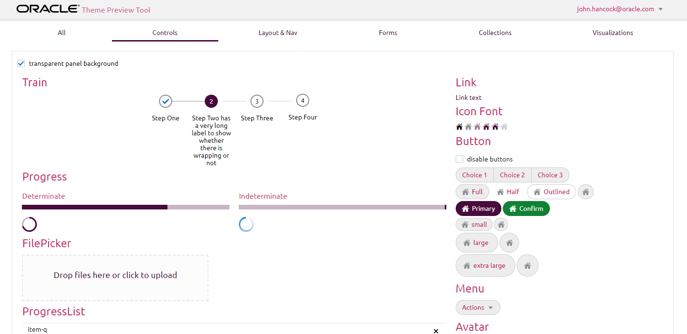


## 1: Get Started

For this part of the workshop, we will assume that you have already taken Part I, and have JET properly installed and working.

If you do not have JET installed, please go [back to Part I](/part1.md) and follow the steps through at least section 1b.

It is also assumed that you already know something about [SASS](http://sass-lang.com/) (Syntactically Awesome StyleSheets). It's not a requirement that you know SASS for this workshop, but if you go any deeper into creating your own theme, you will need to know SASS itself. Some good resources for learning about SASS can be found at:

* [SASS Documentation](http://sass-lang.com/documentation/file.SASS_REFERENCE.html)
* [YouTube video series](https://www.youtube.com/playlist?list=PL2CB1F80266E986EA)

### (a) Downloading the sample project

The workshop will use a sample project that has already been put together for you. This project has every JET UI component included in it so that you can very quickly see the effect your custom theme changes will have on JET itself.

1. Download this [sample project](https://github.com/peppertech/OracleJETWorkshop2019/wiki/project/ThemeStarter.zip) and unzip it into a project directory.
2. Open a terminal/command window and goto the directory that you unzipped the sample project into.
3. Change into the *ThemeStarter* directory.
4. From the root of the project folder run this command

```js
ojet restore
```

When the restore command is completed, you should see something like the image below.

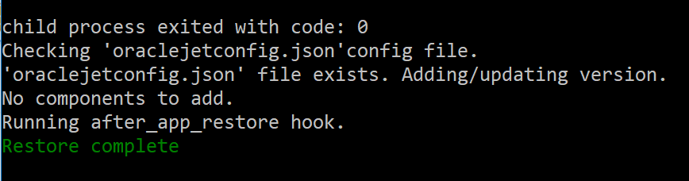

### (b) Running the sample project

As with your previous work with the JET CLI, you can build and serve the project. Run the below command to see what the project looks like by default.

```js
ojet serve
```
This project contains multiple pages that have a vast majority of the JET components included in them.  The *All* page is just that, it contains all of the components. The other pages have the same components broken out into smaller categories.  The project also has a custom *after-build* hook script that packages the custom theme that you are going to write during this workshop, into a .zip file so that you can share it or re-use it in other applications. Specifically with a Visual Builder application, as you will see at the end of the workshop.

After you've had a look around, press Ctrl-C in the command window to stop the server.

### (c) Add SASS

Now that you have the sample project working, let's set things up for working with SASS. If you aren't already familiar with what SASS does, and how it works, please use the resources listed at the beginning of the workshop under the *Get Started* section. 

From the command line, run the below command.

```js
ojet add sass
```

You will see the library *node-sass* being installed. This library is used for actually compiling your .scss (SASS) source code into CSS that the application use. Once it's completed, you're ready to create your own theme.

### (d) Create custom theme

To create your own theme, you will run the below command. The new theme will be added under the /src/themes folder. **All** work that you will be doing will be in this directory.  

```js
ojet create theme myTheme
```
After your theme has been created, look in the /src folder and you should now see a new /themes folder and inside of that, your /myTheme folder.

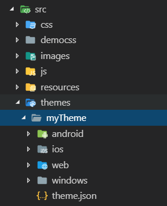

**Tip:** The /themes directory that you will see off of the root of the project can, and should, be ignored. It's created as part of the build process. You should not edit or change files in this directory as they will be overwritten. Always do your development work in the /src folder.

You are now ready to start making your own theme!

**Note:** Make sure you have a CSS editor, such as Visual Studio or Apache NetBeans, and open the sources created in step 1 above. Simply using Notepad will not provide the syntax coloring and other helpful CSS editor features. 

## 2: Understanding the Theme structure

As you've seen in the directory structure image above, your new theme has SASS source code (.scss) files for multiple platforms.  When you build a JET application using the JET tooling, a platform specific theme is automatically added to your app for the platform you are targeting.  You can override this by adding the --themes argument to the build/serve command.

For this workshop, you are going to focus on the /web theme only.  You should explore the other themes at another time, to compare some of the differences.

### (a) File dependencies

1. Change into the /src/themes/myTheme/web directory.

    You will see two files by default.
    * _myTheme.web.settings.scss
    * myTheme.scss

2. Open the myTheme.scss file in your editor of choice.

As you will read in the comments at the top of this file, this is the main aggregator for any other SASS source files that you will create for your theme.

The way that theming works with JET, is that the base Alta theme is available by default, and then changes are made to override the various settings where wanted.  Anything that is not overridden will be managed by the base .scss source.

The overriding settings file in this case, is called *_myTheme.web.settings.scss*

### (b) The settings file

Open the *_myTheme.web.settings.scss* file in an editor of your choice.

**Tip:** You may wonder why the settings filename starts with an underscore ( _ ).  In the SASS world, this tells the SASS compiler that this is a *partial* file and that it should not be compiled by itself into a .css file. It must be combined with something else.

One of the first things you will see about the settings file is that it's very large.  There is a lot of information in this one file.  If you plan to create a completely custom theme, it's recommended that you read through the comments in this file completely.  Naming conventions, path structures, and best practices are all discussed throughout the document. It is also recommended that you read the [Theming Chapter of the JET Developers Guide](http://www.oracle.com/pls/topic/lookup?ctx=jet620&id=GUID-E42E9B44-CD53-41D5-A386-9E941A9471CE). 

When you have completed the desired changes to the settings file, and your custom theme looks the way you want it to. It's recommended that you remove all of the remaining commented variables to decrease the size of the file and help with future compilation times.

## 3: The basics

Now that you've looked over the settings file, and how the files are aggregated into a single .css file when compiled, it's time to start making changes.

### (a) Brand color

So you can see changes happening as you make them, run the following command from the root of your project:

```js
ojet serve --themes=myTheme:all
```
**TIP:** The above command will build and serve the project using the specific theme that you've stated, as well as all of the variations, like Android, iOS, Windows, and Web (the default).  If you only want to build and test for web, you can change the last argument to be *web* instead of *all*

Going back to your Editor, in the settings file (_mytheme.web.settings.scss) search for the variable *$brandColor*.  Go to the third instance of the name.  It should take you to approximately line 291 in the file, and looks like this:

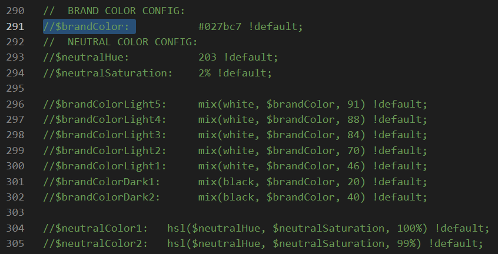;

Uncomment the line for this variable, as well as all of the color variables between this and the start of the *DVT Colors* section.

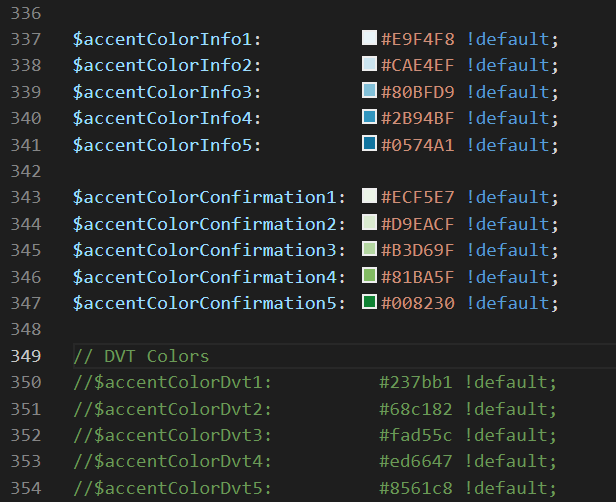

Change the value for the *$brandColor* variable to be: **#490A3D**

Save your changes and watch what happens in the browser. Click on the buttons and see how the base color is no longer a shade of blue.  Notice the gradients that are used for the icon states has been generated for you a well, based off of this new base brand color.

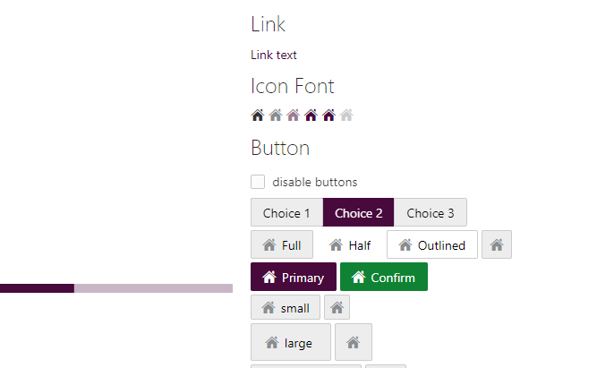

### (b) Font-family (web fonts)

By default the JET themes use the System font for each platform that you run your app on.  A new trend in web app development is to use a Web Font instead.

In the settings file again, search for the *$fontFamily* variable. Go to the second instance that is found. It should be at approximately line 411 in the file, and will look like the image below.  Here you will see the defaults for Apple(Mac), Windows, and a fallback to Hevetica Neue as a default.

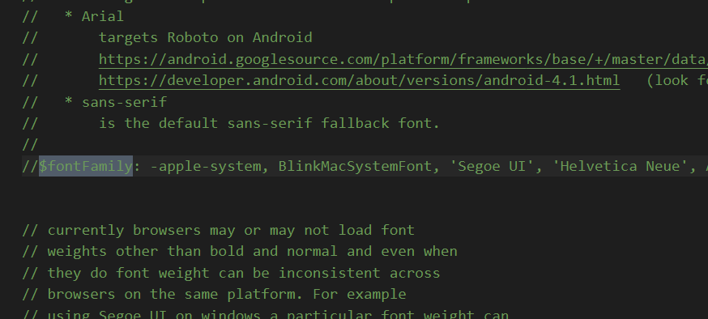

You are going to add a Web Font called "Ubuntu" as the default font family for your application.  To do this, you first need to download or configure your application to reference a CDN location for the web font files.

In a browser, go to the [Google Web Fonts website](https://fonts.google.com/specimen/Ubuntu) for the Ubuntu web font to see the specifications and learn more about how to use the font family.

Scroll down on this website and look for the **Popular Pairings with Ubuntu** section on the left side of the screen. It looks like the image below.

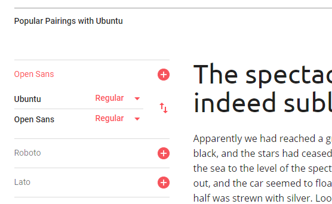

Click on the toggle arrows to switch back and forth between the Ubuntu example and the Open Sans example. A good point of reference for noticing the difference is the lower case T and L between the two fonts.

To learn more about how to use the Ubuntu font, move up to the top of the website and click on the link in the top right corner that says, "**Select this font**" It looks like the image below.  

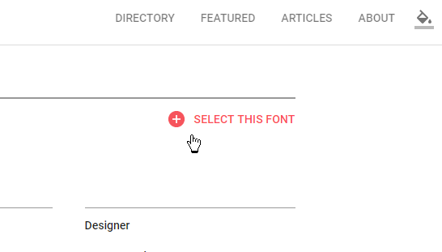

Once you select this font, a panel will show up at the bottom of your browser. Click on this panel and it will expand up into the page with details about the usage of the font.  It should look like the image below.

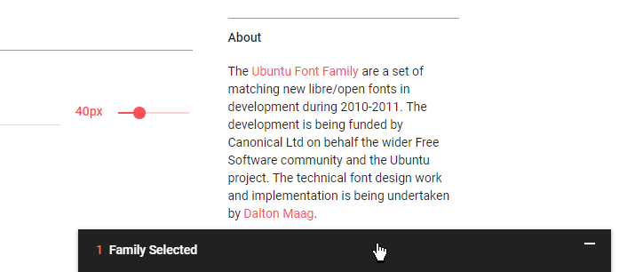

Copy the text for the **\<link>** from the panel, as shown with the arrow in the above image.

In your editor, open the *src/index.html* file, and paste this new link reference into the **\<head>** section of the file just under the reference to the */democss/app.css* stylesheet. It will look like the image below when saved.

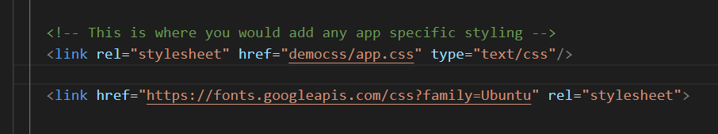

Save the changes to index.html and go back to the _myTheme.web.settings.scss file in your editor.

Uncomment the $fontFamily line and add a reference to the new web font that you just added to index.html

```css
$fontFamily: 'Ubuntu', -apple-system, BlinkMacSystemFont, 'Segoe UI', 'Helvetica Neue', Arial, sans-serif !default;
```

Save the file and take a look at the application running in the browser again. Take a careful look at the lowercase **T** in *Icon Font* and *Button* areas of the page.

**NOTE:** The *node-sass* library used for build time compilation can be rather fragile.  If it hasn't crashed yet while you've been working on the changes above, it most likely will at some point in the future.  When this happens, you simple need to rerun the *ojet serve --themes=myTheme:all* command which will open a new browser tab. You can close the old tab and continue on with the new one. This fragility is another reason to look forward to the move to CSS Variables. 

### (c) Font colors

Now that you have a nice new web font added to your theme, it's time to add a little more color to your theme by making changes to the font color variables.

In the settings file, search for *Text Color* string. Go to the first instance that you find.  This should be at approximately line 363 of the file.

Uncomment the $textColorBase variable and all $textColor variables 1 thru 7. Allowing $textColor1 thru $textColor7 to also be set, allows the proper gradients to be generated based off of the new $textColorBase variable. It will look like the image below when updated.

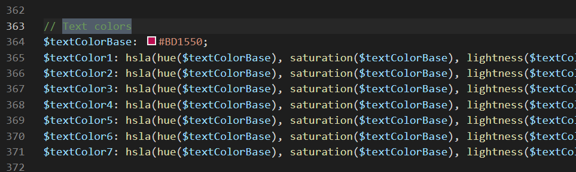

Change the value for the $textColorBase variable to be **#BD1550**

Save the changes and take a look at the results in the browser.

That definitely added some color to the page, but maybe just a little to much. Notice the Icon Font (little houses) section and the text color for the input fields inside the message section, further down the page.  They are both red as well now.

Going back to the settings file, go to the second instance of the *Text Colors* search results.  This will take you to approximately line 458 in the file.

Uncomment the *$textColor* variable and change it's color from $textColor3, to be **#000000**.

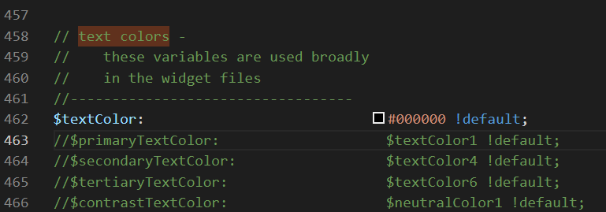

Save the changes and take another look at the browser to see the new look.

### (d) Buttons

The final area that you are going to change in your theme is the styling of the default buttons.  You will see all different kinds of button styles on various websites across the Internet.  Most often, the border radius for the button corners is one of the most distinctive differences.  You are going to change the default button in your them to have rounded ends, instead of the existing more square look for the default Alta theme that JET distributes with.

Back in the settings file, search for *$buttonBorderRadius* and go to the first instance that you find.  It will be at approximately line 1242 of the file.

Take a few minutes to look over all of the different variables that are available for just working with Buttons, in the JET theming source.  There are over 200 lines of code here that covers all of the possible button states (hover, selected, active, etc.) as well as different kinds of buttons like outlined, half-chrome, or full-chrome.  You can do a lot of customizing in this area.  For this workshop you are only going to change one variable.

Uncomment and change the value of the *$buttonBorderRadius* from $mediumBorderRadius to **25px**

The settings file should look like the below image, after making the above changes.

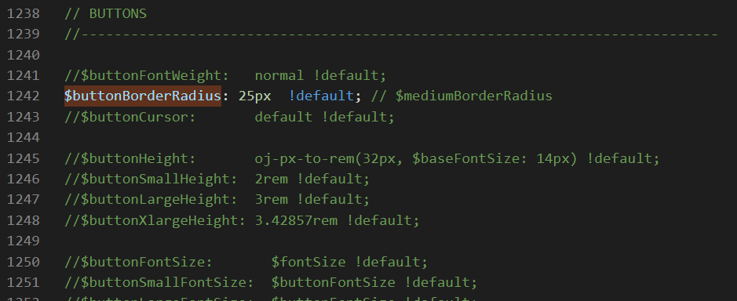

Your ThemeStarter application should now look like the below image with all of the changes made.


## 4: Using your custom theme in Visual Builder


Can there ever be enough Pugs in the world!?

